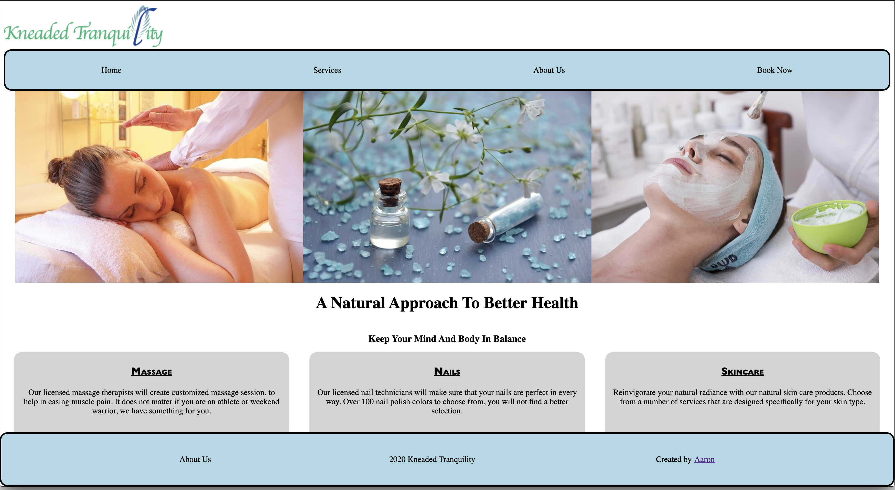

# Kneaded Tranquility

## User Stories

* As a typical user I want to be able to schedule an appointment without picking up the phone.
* As a typical user I would like to see my past and future appointments and who they were with.
* As a user I would like to be able to navigate through a spas website wihtout confusion.
* As a spa owner I would like to see the appoinments in a user friendly way.

## Features MVP
* Sign Up Page with First Name, Last Name, Email, Phone Number
* Log-in Page with Email and Password authentication
* A way for the user to schedule a spa appointment and certain employee availability
* When a user is logged in will be able to see their past and future appointments

## Stretch Goals
* A sign in page for employees to see clients that are scheduled.

## Overall Structure

### Back end
The app was built using Express with a PostgreSQL Database. The Kneaded Tranquility App is RESTful

### Front end
The front end is completely built with React and JavaScript. Using React there wasn't any need for refreshes or extra calls to the database. 

### Libraries
* React.js
* BCrypt
* Express
* Sequelize
* Redux
* React-datepicker

## Tables

* Users(clients)
    * First Name
    * Last Name 
    * Password Hashed
    * Phone Number
* Service
    * Type
        * massage
        * Facial
        * nails
    * Price
* Appointment
    * Day
    * Month
    * Year
    * Time
    * Service Id (belongs to service.id)
    * user Id (belongs to user.id)

